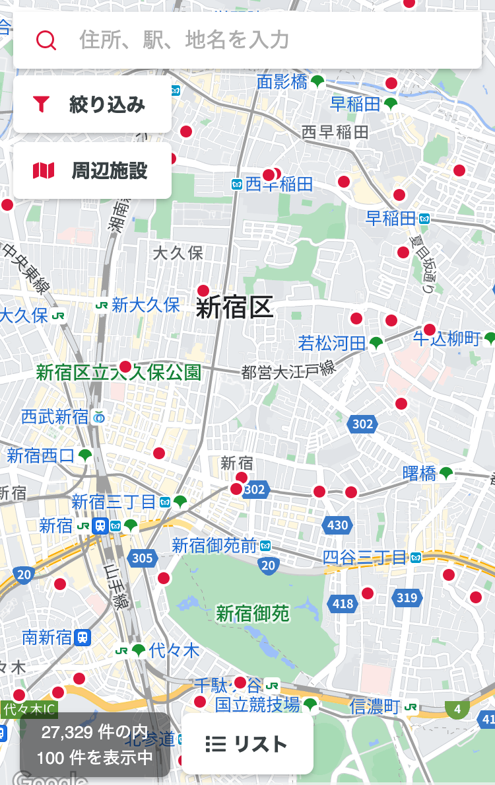

# real-estate-site

A web application for finding cheap and affordable properties to rent in Japan.
This app introduces a new way to search for properties in comparison to existing Japanese real estate services by using the Google API to allow users to search directly via keywords such as station names, city, prefecture etc. and mainly navigating a map similar to Google Map.

This code is only a skeleton and no longer builds.

